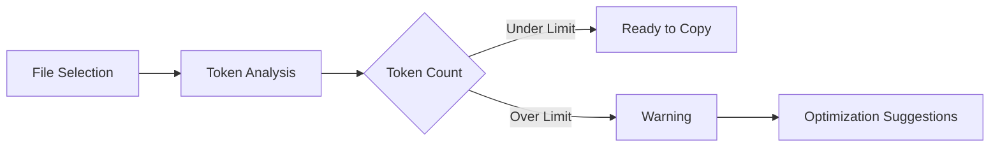
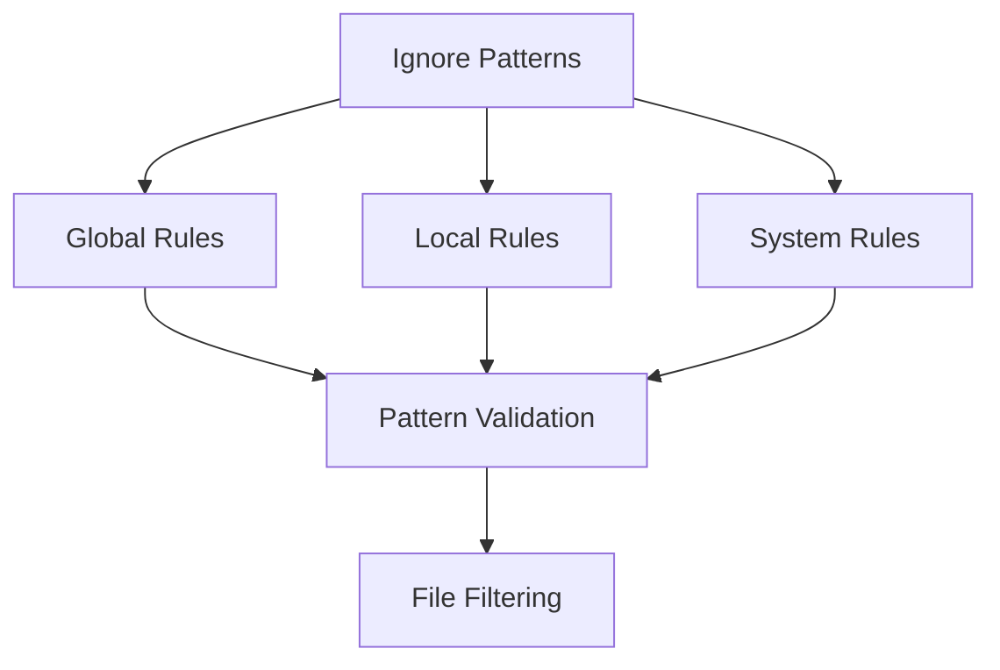
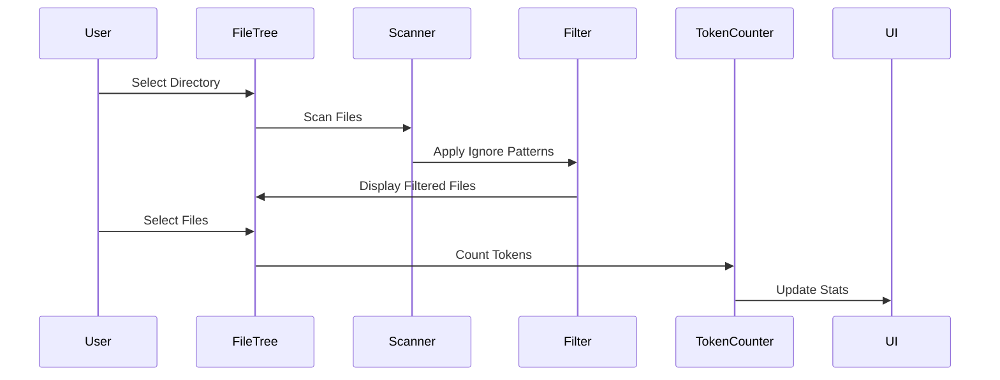
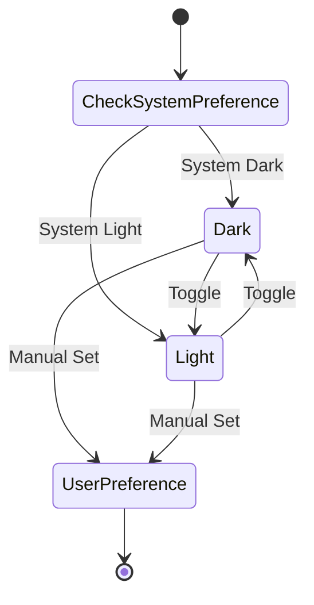

# PasteMax Features Documentation

## Screenshots & Visual Documentation

### Main Interface
<div align="center">
  
  <p>Main application interface showing the file tree, controls, and output area</p>
</div>

### Key Features Visualization

#### File Tree & Selection
```ascii
📁 project/
├── 📁 src/
│   ├── 📄 App.tsx ✓
│   ├── 📁 components/
│   │   ├── 📄 Sidebar.tsx ✓
│   │   └── 📄 FileList.tsx
│   └── 📁 utils/
│       └── 📄 fileUtils.ts ✓
└── 📄 package.json
```
*File tree with selected files (✓) and folder structure*

#### Theme Modes
<div style="display: flex; justify-content: space-between;">
  <div>
    
    <p align="center">Light Theme</p>
  </div>
  <div>
    
    <p align="center">Dark Theme</p>
  </div>
</div>

#### Token Analysis


#### Ignore Pattern System


### Workflow Diagrams

#### File Selection Process


#### Theme System


## Core Functionality

### File Tree Navigation
- **Interactive Tree Structure**
  - Hierarchical display of files and folders
  - Dynamic folder expansion/collapse with state persistence
  - Visual breadcrumbs for deep navigation
  - Intuitive drag handle for sidebar resizing (200px - 500px range)
  - Context-aware folder highlighting

- **Selection System**
  - Multi-select capability with Shift/Ctrl(Cmd) support
  - Visual indicators for selected/partial/unselected states
  - Folder-level selection propagation to children
  - Selection count and size display
  - Selection persistence across sessions

## File Management & Analysis

### File Selection Features
- **Smart Selection Tools**
  - Bulk selection by file type
  - Pattern-based selection (e.g., `*.ts`, `src/*`)
  - Inverse selection capability
  - Selection history with undo/redo
  - Quick selection clear

### File Information Display
- **Detailed File Stats**
  - Real-time token counting
  - File size with smart formatting (KB/MB/GB)
  - Last modified timestamp with relative time
  - Git status integration (if in repository)
  - File type detection and icons

### Token Analysis
- **Token Management**
  - Per-file token count
  - Cumulative token count for selections
  - Token count warnings (approaching limits)
  - Token estimation for binary files
  - Token usage optimization suggestions

## Search & Filter Capabilities

### Search Features
- **Advanced Search**
  - Real-time search with debouncing
  - Regular expression support
  - Case-sensitive/insensitive options
  - Path-based search
  - Search history tracking

### Sorting & Organization
- **Flexible Sort Options**
  - Token count (ascending/descending)
  - File name (alphabetical/reverse)
  - Last modified (newest/oldest)
  - File size (largest/smallest)
  - Custom sort order persistence

## Ignore Pattern System

### Pattern Management
- **Global Patterns**
  - System-wide ignore rules
  - User-defined global patterns
  - Pattern validation and testing
  - Import/export functionality
  - Pattern conflict resolution

### Local Patterns
- **Per-Directory Rules**
  - Directory-specific overrides
  - Inheritance from parent directories
  - Local pattern priority system
  - Pattern effectiveness analysis
  - Quick toggle switches

### Default System Patterns
- **Binary & Media Files**
  \`\`\`
  *.png, *.jpg, *.jpeg, *.gif, *.ico, 
  *.webp, *.svg, *.pdf, *.zip, *.tar.gz,
  *.tgz, *.rar, *.7z, *.mp4, *.mov,
  *.avi, *.mkv, *.mp3, *.wav, *.flac
  \`\`\`

- **Development Files**
  \`\`\`
  *.min.js, *.min.css, *.map,
  node_modules/, .git/, .svn/,
  __pycache__/, .DS_Store
  \`\`\`

- **Database & System Files**
  \`\`\`
  *.sqlite, *.db, *.sql,
  *.iso, *.bin, *.exe, *.dll, *.so, *.dylib
  \`\`\`

## Output & Display Options

### Tree View Modes
- **Visualization Options**
  - Full tree with expand/collapse
  - Flat list with indentation
  - Selected files only
  - Compact view
  - Custom view layouts

### Content Formatting
- **Output Customization**
  - File headers with metadata
  - Custom separators
  - Token count display options
  - Path display formats
  - Syntax highlighting

### User Instructions
- **Instruction Management**
  - Customizable instruction templates
  - Markdown support
  - Variable substitution
  - Instruction versioning
  - Quick instruction toggling

## Theme System

### Theme Management
- **Theme Options**
  - Light theme (default)
  - Dark theme
  - System theme sync
  - High contrast mode
  - Custom theme support

### Theme Components
- **Styled Elements**
  - Tree view styling
  - Button variants
  - Input fields
  - Dialog boxes
  - Status indicators

## Workspace Features

### Session Management
- **State Persistence**
  - Selected folder history
  - File selection states
  - Search/filter settings
  - UI preferences
  - Window position/size

### Folder Operations
- **Directory Management**
  - Multiple root folder support
  - Quick folder switching
  - Recent folders list
  - Folder bookmarks
  - Auto-reload on changes

## Accessibility Features

### Keyboard Navigation
- **Shortcut System**
  - Tree navigation (arrows)
  - Selection (space/enter)
  - Quick actions (ctrl/cmd + key)
  - Focus management
  - Custom shortcut mapping

### Screen Reader Support
- **ARIA Implementation**
  - Semantic HTML structure
  - Role annotations
  - State descriptions
  - Focus indicators
  - Keyboard focus traps

## Performance Optimizations

### Resource Management
- **Efficient Processing**
  - Virtualized tree rendering
  - Lazy file loading
  - Background processing
  - Memory usage optimization
  - Cache management

### UI Responsiveness
- **Performance Features**
  - Debounced updates
  - Memoized calculations
  - Progressive loading
  - Optimistic updates
  - Smooth animations

## Integration & Platform Support

### Electron Features
- **System Integration**
  - Native file dialogs
  - System notifications
  - Custom protocol handling
  - Auto-updates
  - Deep OS integration

### Cross-Platform
- **Platform Support**
  - macOS optimization
  - Windows adaptation
  - Linux compatibility
  - Consistent behavior
  - Platform-specific features

## Security & Data Protection

### Safety Measures
- **Data Handling**
  - Large file protection
  - Binary file detection
  - Secure file operations
  - Error recovery
  - Data validation

### Privacy Features
- **User Protection**
  - Local-only processing
  - No external dependencies
  - Configurable logging
  - Clear data options
  - Session isolation

## Development & Extensibility

### Code Organization
- **Architecture**
  - React components
  - TypeScript types
  - Electron IPC
  - State management
  - Module system

### Future-Proofing
- **Extensibility**
  - Plugin architecture
  - Custom handlers
  - Event system
  - API endpoints
  - Configuration options 